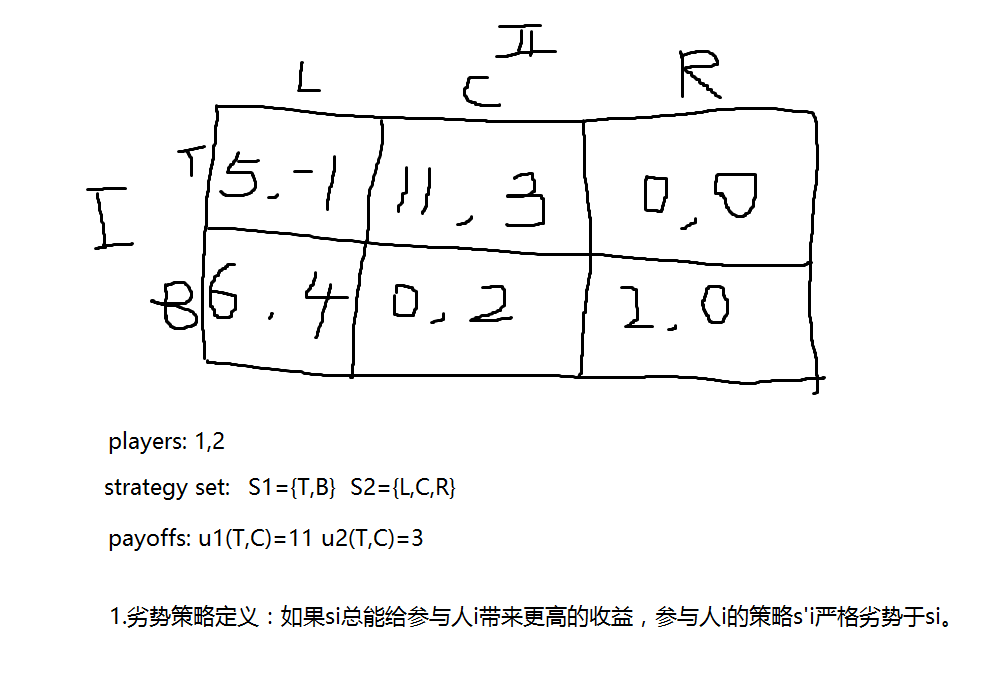
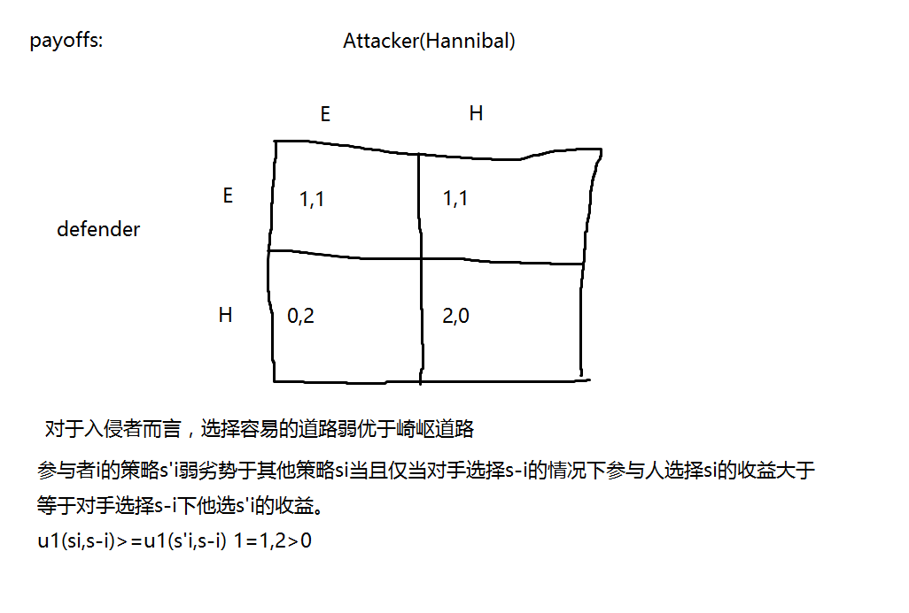

## Formal Stuff(what are the ingredients of a game?)

- players(参与人) 
1.Notation: i or j (to be player i or player j.)
- strategy(策略)
2.Notation: 
si or sj (to be a particular strategy of player i.)
Si(参与人所有的策略集合)
- payoffs(收益)
3.Notation: 
Ui (player i's payoffs)
Ui(s)

**We're going to assume that these are known.**

4.Notation: s-i(It means a strategy choice for everybody except player i)
s'i(其他选择策略)

## First Game

## Second Game

## Third Game

### 简介

写下一个介于1到100之间的数字，计算所有所写数字的平均数，最接近平均数三分之二的人，是这个游戏的赢家。奖金是五美元减去所选值与答案之差。

### 分析

&gt;67: 这是dominated(劣势的)策略，因此大于67的数字应该被剔除。
45~67: 这一策略在原博弈中并不是弱劣势策略，可一旦剔除了>67的策略，这就成了劣势策略了，即弱劣势策略。因此45~67也应该被剔除。
30~45：原来不是劣势，但是剔除上述劣势策略，也就变成了劣势。
20~30：原来不是劣势，但是剔除上述劣势策略，也就变成了劣势。
按照上述逻辑，最终将变成1。实验最终答案是9，因为不是所有人都是理性的。如果重复玩上述游戏，每个人将会玩的更好，那最后的数字将会更低。

**Common knowledge**
要剔除策略，不仅自己是理性的，对手也应该是理性的。如此循环

