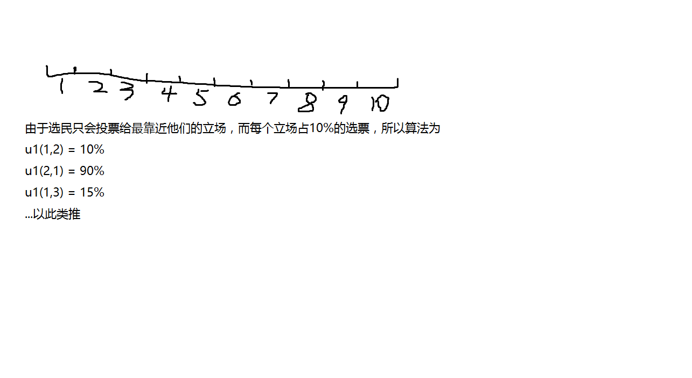
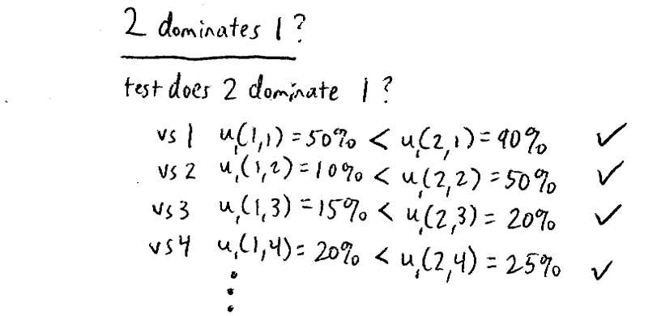
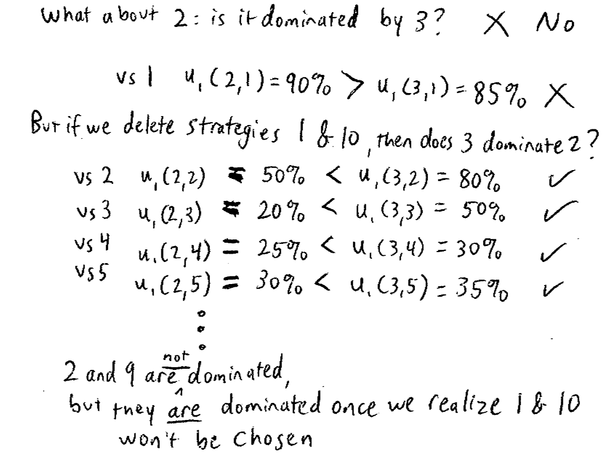

## Model of Politics

一共有10个策略，每个立场都会得到10%的选票。(1,2,3,4,5,6,7,8,9,10)
选民会投票了离他们最近的候选人。
出现平局，选票会被分摊。

payoffs:the candidates希望尽可能最大化获得选票。

(选择立场2总比选择立场1多5%的选票)
2 strictly dominates 1
9 strictly dominates 10

如此迭代剔除，最后只剩下5和6.
**中间选民定理**（Median Voter Theorem）